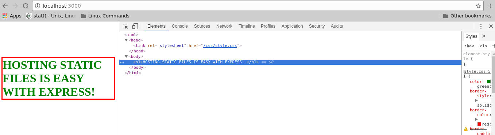

# "Express Barebones"

Installing Express
--------------------------------------------------------------------------------
	1. Type in command line: npm init
	2. Run through the command line interface to create package.json file.
	3. Type in command line: npm install express --save

Preview
--------------------------------------------------------------------------------

